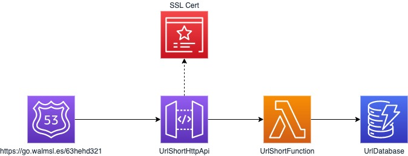

# url-shortener

This is a simple serverless URL shortening project using a combination of Route53, API Gateway, Certificate Manager, Python Lambda and DynamoDB.



## How It Works

The URL Shortener is pretty simple to operate.  Someone will enter a URL with a shortened **<slug>** at the end, for example, **https://your-own.domain.com/d345k3ssd** which causes the following chain of actions:

- The domain maps to the **Custom Domain** for the HTTP Api and the path (**d345k3ssd**) is passed to the Python lambda which is executed
- The lambda handler takes the path **slug** and uses this as a Primary Key lookup into a simple DynamoDB table.
- The returned value will contain the actual destination **url** which is returned by the API as an **HTTP 301 Permanent Redirect** to the browser.
- If a record is not found - an error HTML page is returned instead with a 301 redirect to a defined redirect URL.  This should be something that makes sense within the context of your URL shortener.

## Pre-Requisites

Before deploying this project has several Parameters that need to be provided to ensure corect deployment and configuration:

- **DomainName** - the domain name for the Custom Domain created for the HTTP Rest API.
- **HostedZoneId** - The ID for the hosted Zone of the **DomainName** used for your deployment.
- **CertificateArn** - the ARN of the certificate that you will need to manually create to enable the custom domain on the HTTP API.
- **RedirectUrl** - when a shortened URL Id (slug) is not found - a simple redirect HTML page is shown.  The URL value of this variable will define the redirect location.
- **LogLevel** - defines the deployed value of the Lambda environment variable LOGLEVEL which is used to change the logging behavior of the Lambda itself.  Defaults to **ERROR**.


## Deploy the URL Shortener

To build and deploy your application for the first time, run the following in your shell:

```bash
make build
make guided
```

The first command will build the source of your application. The second command will package and deploy your application to AWS, with a series of prompts:

**Note:** During the "make guided" you will be asked about the "UrlShortFunction has no authentication. Is this okay?" - YES this is okay - we do not want any authentication on the URL shortener by design.

* **Stack Name**: The name of the stack to deploy to CloudFormation. This should be unique to your account and region, and a good starting point would be something matching your project name.
* **AWS Region**: The AWS region you want to deploy your app to.
* **Parameters**: You will be prompted for the value of each of the environment variables so be prepared and check the **Pre-Requisites** for details on the Parameters.
* **Confirm changes before deploy**: If set to yes, any change sets will be shown to you before execution for manual review. If set to no, the AWS SAM CLI will automatically deploy application changes.
* **Allow SAM CLI IAM role creation**: Many AWS SAM templates, including this example, create AWS IAM roles required for the AWS Lambda function(s) included to access AWS services. By default, these are scoped down to minimum required permissions. To deploy an AWS CloudFormation stack which creates or modifies IAM roles, the `CAPABILITY_IAM` value for `capabilities` must be provided. If permission isn't provided through this prompt, to deploy this example you must explicitly pass `--capabilities CAPABILITY_IAM` to the `sam deploy` command.
* **Save arguments to samconfig.toml**: If set to yes, your choices will be saved to a configuration file inside the project, so that in the future you can just re-run `sam deploy` without parameters to deploy changes to your application.

At the end of the **make guided** you are prompted to save the configuration to samconfig.toml file.  You should do this and provide a unique name for the configuration.

Once a configuration is saved you can deploy it using **sam cli**.  Do not use **make deploy**, this will only work for a default configuration.

To deploy:

```bash
sam deploy --config-env <saved-config-name>
```

If you need a custom aws profile for deployment you can also add **-**-profile** to name your aws cli profile

```bash
sam deploy --config-env <saved-config-name> --profile <profile-name>
```

## Adding Shortened URLs

This service is only the **fetch** side of the URL shortener.  There needs to be a user interface built to enable the management of URLs.  You can also choose to directly add them to the DynamoDB table using the AWS Console, which is what I do.

## Use the SAM CLI to build and Test Locally

Build your application with the `sam build` command.

```bash
url-shortener$ make build
```

The SAM CLI installs dependencies defined in `src/requirements.txt`, creates a deployment package, and saves it in the `.aws-sam/build` folder.

Test a single function by invoking it directly with a test event. An event is a JSON document that represents the input that the function receives from the event source. Test events are included in the `events` folder in this project.

## Cleanup

To delete the sample application that you created, use the AWS CLI. Assuming you used your project name for the stack name, you can run the following:

```bash
sam delete --config-env <saved-config-name> --profile <saved-profile>
```
