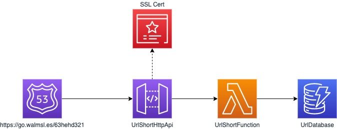

# url-shortener

This is a simple serverless URL shortening project using a combination of Route53, API Gateway, Certificate Manager, Lambda and DynamoDB.

I wanted to create my own personal URL Shortener to provide a more personal touch to links that I share in blog posts and social media :bowtie: 

I have created a domain called: **walmsl.es** which is based on my [Twitter handle](https://twitter.com/walmsles) I use and also the profile slug on [LinkedIn](https://www.linkedin.com/in/walmsles/) and [GitHub](https://github.com/walmsles).  So now I can create my very won short urls which will have a URL like this: [https://go.walmsl.es/30bf0976](https://go.walmsl.es/30bf0976).

This partifcular project automates 99.99999% of creating the project other than setup of Route53 and the actual domain name (I do this all in a master account seperate from where my production code is deployed so this is the manual part).




# Dependencies

This project has a number of external dependencies which are referenced via the SSM parameter store resolve statements in the SAM Template.yaml file.  These dependencies are defined statically within AWS using created SSM Parameters using the paths defined below:

- **/url-shortener/domain:** The domain to use for the API Custom Domain creation for the HTTPApi.  You will need to have a domain configured for this to work.
- **/url-shortener/certificateARN:** An ARN of a valid certificate for the domain so that SSL resolution will work.
- **/url-shortener/log-level:** Defines the LOG_LEVEL applied to lambda environment variables


## Deploy the URL Shortener

To build and deploy your application for the first time, run the following in your shell:

```bash
sam build 
sam deploy --guided
```

The first command will build the source of your application. The second command will package and deploy your application to AWS, with a series of prompts:

* **Stack Name**: The name of the stack to deploy to CloudFormation. This should be unique to your account and region, and a good starting point would be something matching your project name.
* **AWS Region**: The AWS region you want to deploy your app to.
* **Environment**: The environment name to use for the deployment and used in template.yaml to define stack names and resource names.
* **Confirm changes before deploy**: If set to yes, any change sets will be shown to you before execution for manual review. If set to no, the AWS SAM CLI will automatically deploy application changes.
* **Allow SAM CLI IAM role creation**: Many AWS SAM templates, including this example, create AWS IAM roles required for the AWS Lambda function(s) included to access AWS services. By default, these are scoped down to minimum required permissions. To deploy an AWS CloudFormation stack which creates or modifies IAM roles, the `CAPABILITY_IAM` value for `capabilities` must be provided. If permission isn't provided through this prompt, to deploy this example you must explicitly pass `--capabilities CAPABILITY_IAM` to the `sam deploy` command.
* **Save arguments to samconfig.toml**: If set to yes, your choices will be saved to a configuration file inside the project, so that in the future you can just re-run `sam deploy` without parameters to deploy changes to your application.

You can find your API Gateway Endpoint URL in the output values displayed after deployment.

## Use the SAM CLI to build and test locally

Build your application with the `sam build` command.

```bash
url-shortener$ sam build 
```

The SAM CLI installs dependencies defined in `src/requirements.txt`, creates a deployment package, and saves it in the `.aws-sam/build` folder.

Test a single function by invoking it directly with a test event. An event is a JSON document that represents the input that the function receives from the event source. Test events are included in the `events` folder in this project.
## Cleanup

To delete the sample application that you created, use the AWS CLI. Assuming you used your project name for the stack name, you can run the following:

```bash
sam delete --config-env <env-name>
```

